+++
title = "Databricks: CICD - AzureDevOps"
date = "2025-06-18"
lastmod = 2025-12-11
author = "TatiMun"
keywords = ["AzureDevOps","Databricks"]
summary = "Troubleshooting de la documentacion de Microsoft"
draft = false
type = "post"
tags = ["AzureDevOps","Databricks"]
+++

## Problematica:  

Databricks y AzureDevOps ofrecen una integracion entre ellos utilizando databricks bundles y demas, o sincronizando diferentes servicios entre ellos. En el contexto de securitizacion de una empresa, es inseguro exponer un keyvault para que AzureDevOps acceda dado que este esta por fuera de la red de Azure. 

# Contenido:

- [Azure DevOps](#¿Que-es-Azure-DevOps?)
- [Requisitos y permisos](#requisitos)
- [Flujo de trabajo](#Flujo-de-Trabajo)
- [Flujo de Trabajo Actual](#Flujo-de-trabajo-Actual)
 

### Creacion de requisitos

- [Creacion de la app registration  ](#Creacion-de-app-registration)
- [Creacion de Certificado](#Creacion-de-Certificado)
- [Creacion del service connection](#Creacion-del-service-connection)
- [Configuracion del Data Factory](#Configuracion-del-Data-Factory)
 

### Creacion de Pipelines

- [Creacion de Pipeline](#Creacion-de-pipeline)
- [Creacion de Release](#Creacion-del-Release)
- [Variable](#variables)  
 

        
- [Troubleshootings](#TroubleShootings)
- [Bibiliografia](#Bibliografia)

# ¿Que es Azure DevOps?

# Requisitos

Cada grupo de permisos dentro de Azure contiene grupos de Active Directory 

- Permisos requeridos: 
    - Build Adminitrator: Permite la creacion de releases, recursos y administracion de builds para el proyecto (Seguridad Informatica es el equipo encargado de asignar los permisos a los diferentes proyectos)  
    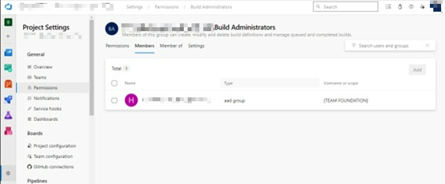

     
     - Service Connection User: Permite leer y utilizar las Service connection (Seguridad Informatica es el equipo encargado de asignar permisos a los diferentes proyectos) 

    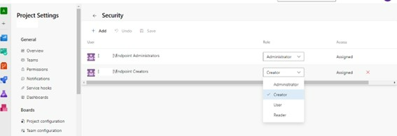
    
     - (Project Settings -> Service Connections -> Security, donde Endpoint Adminitrator y Endpoint Creators son grupos de permisos declarados dentro de Permissions)
---

# Flujo de Trabajo 

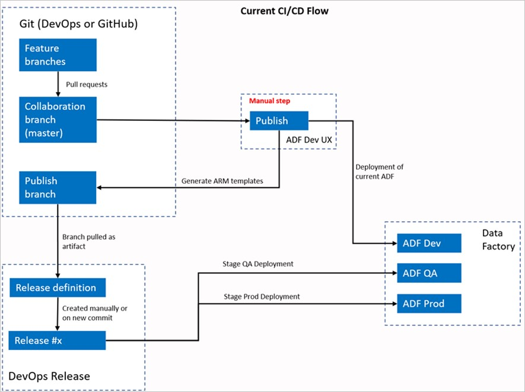

(Este flujo de trabajo es el anterior)

En este flujo cada usuario hace sus cambios en sus ramas individuales, pushea hacia main mediante pull request. Esto te deriva hacia Azure DevOps y se realizan los cambios en main (ADO). 

Los usuarios deben ir hacia el ADF y clickear Publish para aplicar los cambios hacia Live Mode y generar el ARM Template para enviarlo hacia adf-publish 
El pipeline reléase esta configurado para crear un nuevo relerase y deployar un template cada vez que un cambio es publicado hacia la publish Branch (adf-publish) 

---

# Flujo de trabajo Actual

.jpg)

En esta versión del flujo de trabajo, cada usuario hará cambios en su ramas individuales, va a crear pull request hacia main para realizar cambios .
El build es triggearado cada vez que un nuevo commit se hace a main (ADF y Azure DevOps), valida los recursos y genera la ARM Template como artifact si la validación es exitosa. 
El pipeline reléase es configurado para crear un nuevo reléase y deployar el ARM Template cada vez que un nuevo build esta disponible, en este caso, la rama de publicación se volvería obsoleta

Esta versión utiliza el ADFUtilities package que esta en la carpeta de build en el Azure DevOps que permite generar el ARM, el build pipeline es el responsable de validar en ADF si están los recursos y generar ese template en vez de depender del botón Publish en el ADF 

---

# Creacion de la app registration

1. Requisitos
2. Creacion de App Registration: Deberá tener permisos de Contributor sobre el resource group donde se encuentre el data factory
3. Creacion de Clave privada (.pem)
4. Creacion de Certificado/Clave publica (.cer, .pem, .crt) 

### Creacion de App Registration

a. Ingresar a portal.azure.com

b. Ir a App registrations (en EntraId) en New Registration  
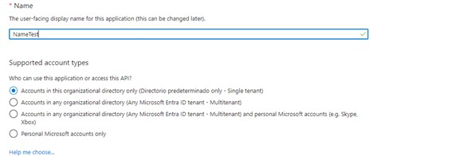

c. En el contexto, elegiremos únicamente Single Tenant

d. En nuestro app registration, deberemos cargar el .cert (Clave publica) en la parte de “Certificates & Secrets” 

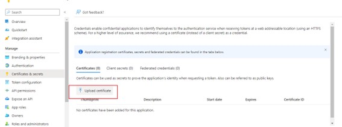

Nota: Esta app registration debe tener permisos contributor sobre la subscripcion o resource group

### Creacion de Certificado

Se le solicita a seguridad la generacion de un certificado publico y una clave privada. 

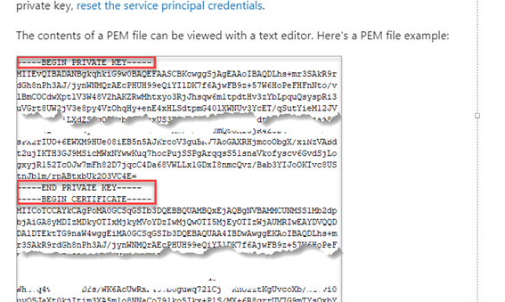

### Creacion del service connection

Conexion entre Azure DevOps y Azure 

Previamente necesitaremos contar con un App Registration, en el cual se cargue el certificado, dado que debe verificar en ambos lados tanto como Azure y Azure DevOps para verificar la conexión y esta app registration debe tener permisos.

Al utilizar certificado es necesario realizar la configuración de forma manual. Es decir, service principal (Manual). 

1. Ir a Azure DevOps > Settings (https://dev.azure.com/{OrganizationName}/{ProjectName}/settings_)
2. Ir a Service Connections
3. Click en crear nueva service connection

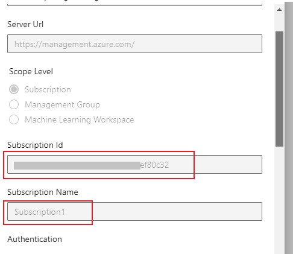
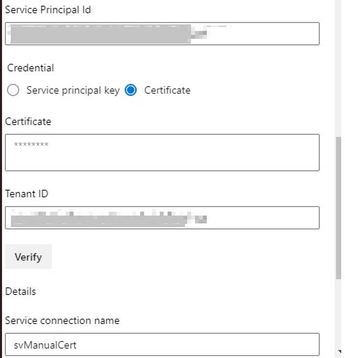

Aca vamos a tener que completar
- Subscription Id: Lo encontraremos en Azure en la parte de Subscription junto con su nombre
- Subscription Name
- Service Principal Id: Lo encontraremos yendo al App Registration
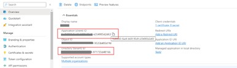
- Certificate: Deberemos seguir el formato del certificado creado antes, es decir, concatenar el certificado publico y la llave privada 

- TenantId: Podremos encontrarlo en la informacion del app registration

4. Damos click en Verify y continuamos

---

# Configuracion del Data Factory 
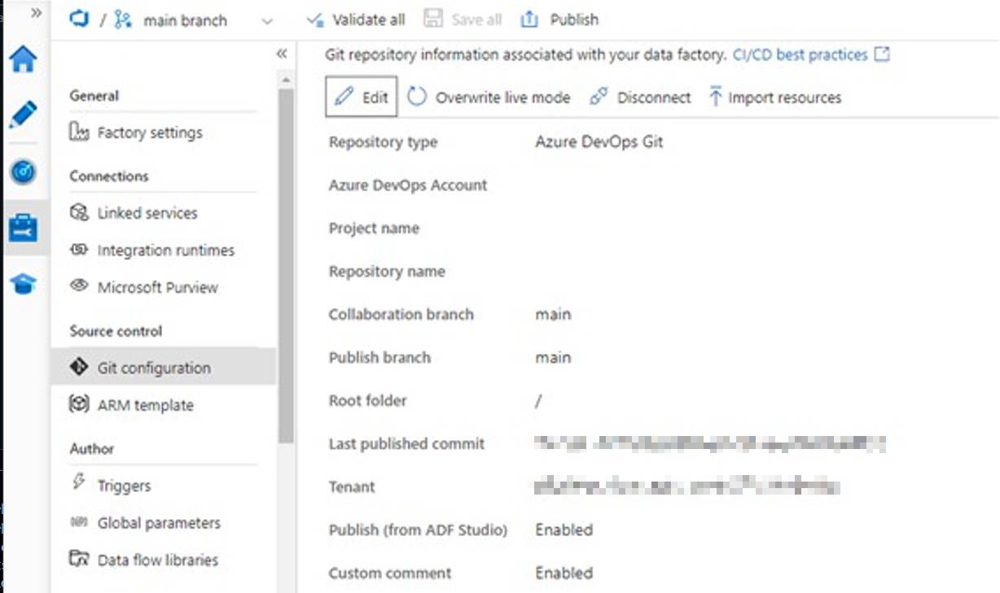

-	Collaboration Branch: Es la rama de ADF donde se enviaran todos los cambios de ramas individuales para triggerear hacia Azure DevOps 
-	Publish Branch(ANTIGUO FLOW): El adf-publish (Publish Branch) sirve para publicar el ARMTemplateForFactory.json una vez finalizado el ciclo de vida, en este caso, no se utilizara ya que gracias a ADFPublishUtilities toma todos los cambios al momento desde el data factory 

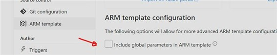

Esta opcion debe estar marcada para poder pasar parametros por pipeline

# Creacion de pipeline

Siguiendo la documentacion, crearemos el pipeline basandonos en un yaml que subiremos al repositorio dentro de la carpeta build. El yaml se encuentra en la documentacion de microsoft.
Pasos: 
1.	Ir a pipelines > Crear nuevo pipeline
2.	Click en Existing Azure Pipeline y elegimos el que subimos al repositorio 
3.	Damos click en guardar y corremos el pipeline

#### Tasks del pipeline: 
-           # Sample YAML file to validate and export an ARM template into a build artifact # Requires a package.json file located in the target repository trigger: 
            - main #collaboration 
                pool: vmImage: 'ubuntu-latest'

El trigger del pipeline indica en que rama se tiene que hacer el cambio para que se ejecute este pipeline. 
El pool indica donde esta alojado la maquina/container efimero que se utilizara para correr este build(pipeline) 

Una vez creado y ejecutado el pipeline, nos devuelve un artifact que triggerea la accion del pipeline release para el deploy.

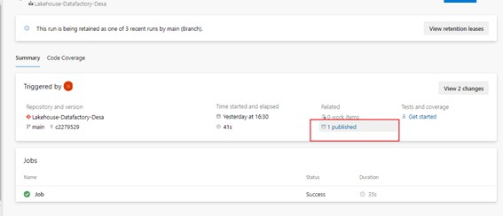
--

---
# Creacion del Release

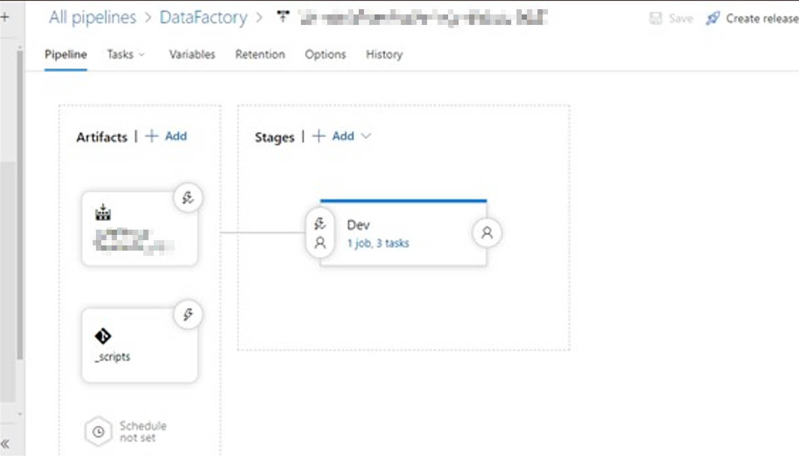

1.	Iremos a dev.azure.com y al projecto que usaremos 
2.	Ir a Pipelines > Releases > Create Release

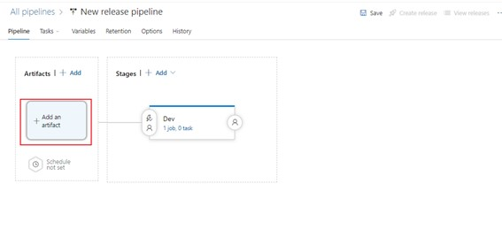

En este punto podemos importar algúna plantilla o crear de cero 

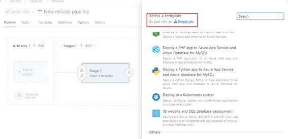

En la parte de Artifacts, pondremos el repositorio donde se generó el build del mismo Azure DevOps

3.	Selecionar Empty Job 
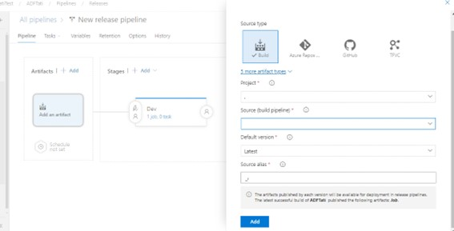

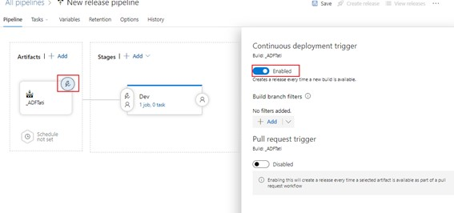

Elegimos build, dado que en nuestro repo tenemos configurado un pipeline build en nuestro repositorio 
-	Project: El Projecto donde estamos posicionados
-	Source: El repositorio donde esta configurado el build
-	Default Version: Version del artifact 
-	Source alias: Nombre del artifacto que se va a asociar a el reléase de cada pipeline

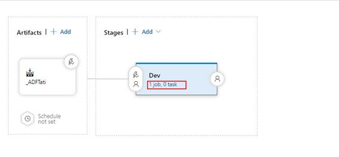

En el icono de trigger, podremos activar el trigger de cada vez que hay un nuevo build disponible, se inicia este pipeline (En nuestro caso, se inicia un nuevo build cada vez que se pushea hacia main) 

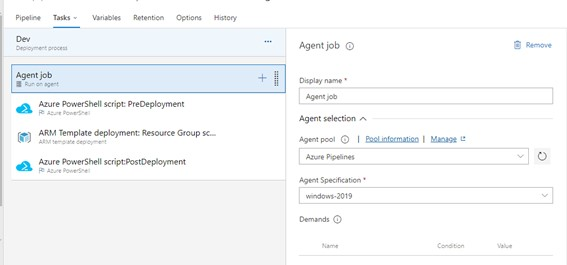
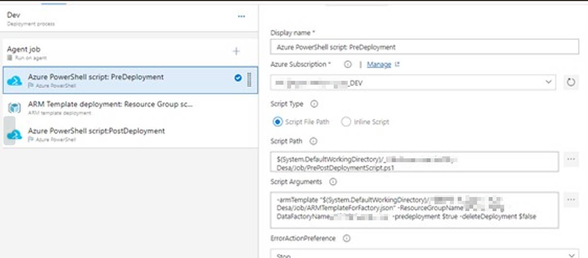

En Agent Specification necesitaremos Windows-2019 (Para este reléase)
El Agent pool es donde se ejecutan los agentes que nos permiten ejecutar los pipelines, como este es Azure Pipelines, se genera un contenedor/maquina efimera que ejecutara el pipeline y se eliminara 

Haciendo clic en el icono de “+” en Agent Job, podremos agregar “Task”. Las tasks serian partes de nuestro pipeline que realizaran diferentes pasos en el pipeline, valga la redundancia. 

Tasks: Azure Powershell script: PreDeployment

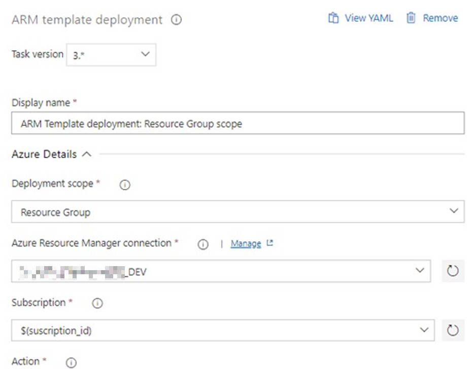

La versión de esta task tiene que ser versión 4* para ser compatible con el script.
-	Azure Subcription: Acá ira el Service connection
-	Script Path: Podremos el path hacia el script que utilizaremos, que se generara dentro de la carpeta del build
-	Script Arguments: Siguiendo la documentación de Microsoft, usaremos:
o	-armTemplate: El path del ARMTemplateForFactory.json dentro de la carpeta del build
o	-ResourceGroupName: Nombre del RG del ADF 
o	-DataFactoryName
o	-Predeployment: En true, ya que esta task tiene que estar primera para ejecutar esa parte del script
o	-DeleteDeployment: False para que no se eliminen los recursos al finalizar el script 
Utilizaremos el Powershell latest versión.

La task siguiente será: ARM Template Deployment: Resource Group Scoupe 

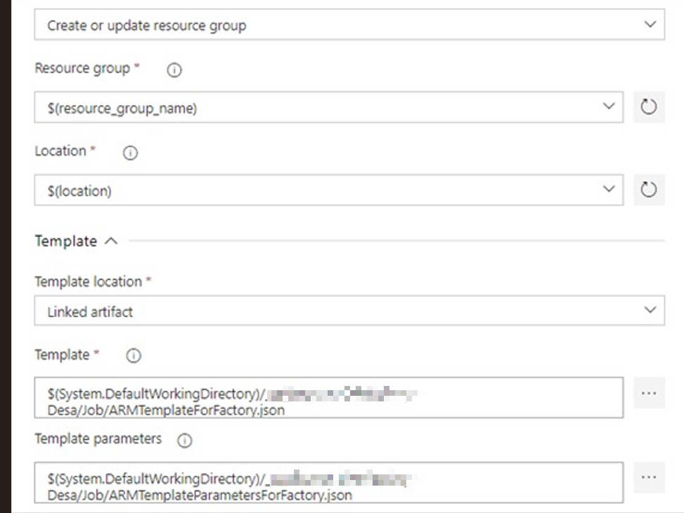
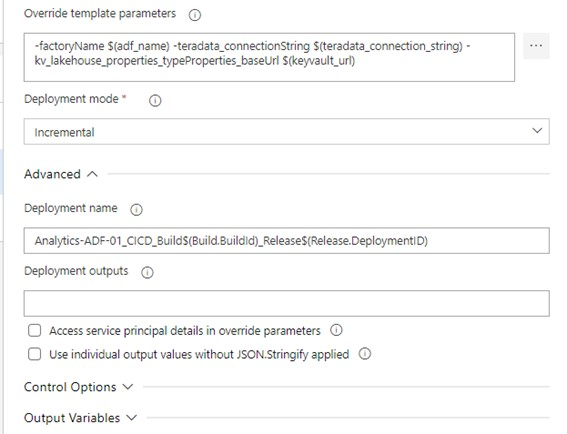

-	Deployment Scope: Resource Group, haremos cambios únicamente dentro del resource group
-	Azure Resource Manager Connection: La Service connection que nos sirve para tomar el rol de una Service account y hacer cambios sobre Azure 
-	Subscription: La ID de la subscription donde trabajaremos 
-	Action: Puede ser Create or update resource group, o Delete resource group que funcionaria como un destroy de todo lo que tengamos definido en el ARM template 
-	Location: La locación donde esta nuestro recurso a desplegar 
-	Template : El path hacia ARMTemplateForFactory.json
-	Template parameters: El path hacia ARMTemplateParametersForFactory.json
-	Override template parametrs: Son las variables que vamos a sobrescribir en cada tasks dependiendo el ambiente
-	Deployment mode: Puede ser incremental (No borra nada, solo crea o updatea recursos) o Complete (Va a borrar todo lo que no este en ARMTemplate)
-	Deployment Name: El nombre de la acción luego del deployment
La siguiente y ultima tasks será Azure Powershell Post Deployment

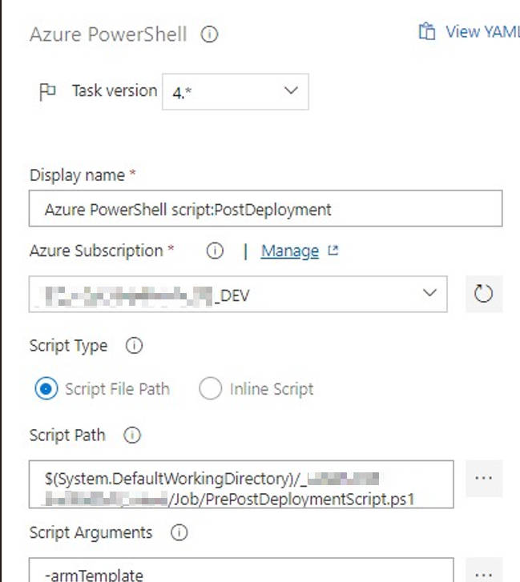
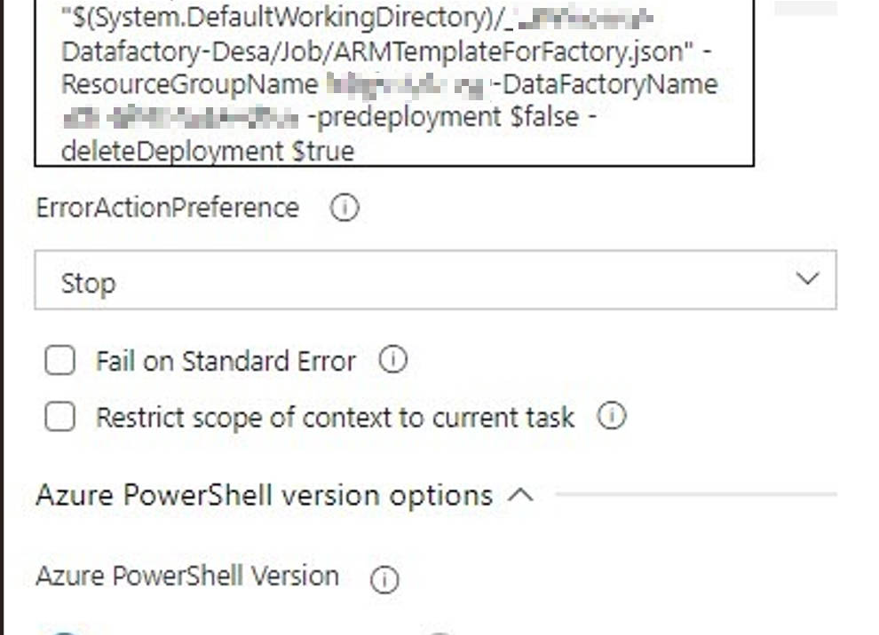

La versión de esta task tiene que ser versión 4* para ser compatible con el script.
-	Azure Subcription: Acá ira el Service connection
-	Script Path: Podremos el path hacia el script que utilizaremos, que se generara dentro de la carpeta del build
-	Script Arguments: Siguiendo la documentación de Microsoft, usaremos:
o	-armTemplate: El path del ARMTemplateForFactory.json dentro de la carpeta del build
o	-ResourceGroupName: Nombre del RG del ADF 
o	-DataFactoryName
o	-Predeployment: En false, ya que es el post deployment
o	-DeleteDeployment: True para eliminar todos los recursos viejos que no estén en el ARM template generado anteriormente 
Utilizaremos el Powershell latest versión.

--- 

# Variables 

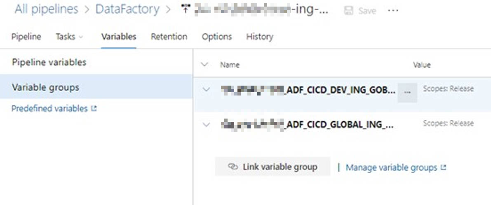

En este caso tenemos dos librerías previamente creadas con valores para cada ambiente, se les agrega el nombre y el value 

Una vez realizado todo esto, podremos hacer clic en créate reléase que ejecutara todo como si hubiésemos triggereado el repositorio 

# Flujo de trabajo de Developers
Referirse al documento de [Manual de Usuario](https://hipotecario.sharepoint.com/:w:/s/SYT-INFRAESTRUCTURATECNOLOGICA-DevOps/EUSYrav4qLlDmZTLZvxnd-8B9DzynnTnRiQGZ0RBzdQ0Ig?e=6KyeMA)

# Aprobacion por ambiente

Requisito: Tener permisos en el proyecto/Organizacion y ser parte de los Release Approvers, no necesariamente se necesita contar con licencia, con "Stakeholder" alcanza 

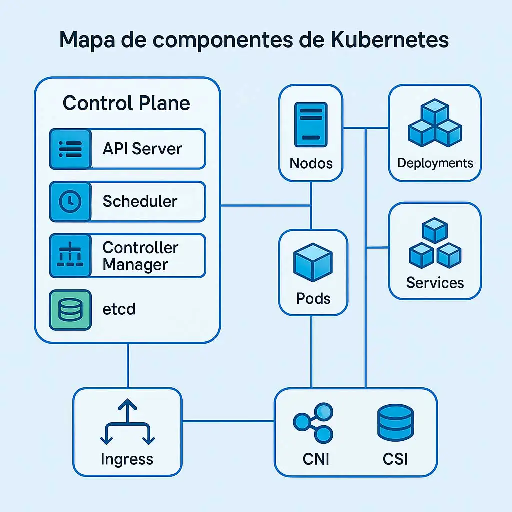

Luego, aguardar a que termine la ejecucion

# TroubleShootings

#### Troubleshooting para el Release
Error al ejecutar reléase pipeline: “Can't open file "D:\AzureDevOps\agent\_work\_temp\clientcertificatepassword.txt"
Error getting passwords”
Este error se soluciona cambiando el agent pool a Windows 2019, y para versión de task de Azure Powershell en 4* 

### Troubleshooting error en el Build

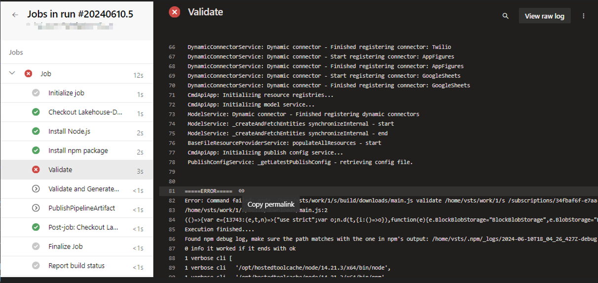

Este error se soluciona verificando la documentacion de [Microsoft](https://learn.microsoft.com/en-us/azure/data-factory/continuous-integration-delivery-improvements?source=recommendations) Verificar la version del "NodeJs" que se instala, si se trata de una version anterior a la que figura en la documentacion, generara ese error indicado en la imagen

## Bibliografia
https://learn.microsoft.com/en-us/azure/data-factory/continuous-integration-delivery-improvements

